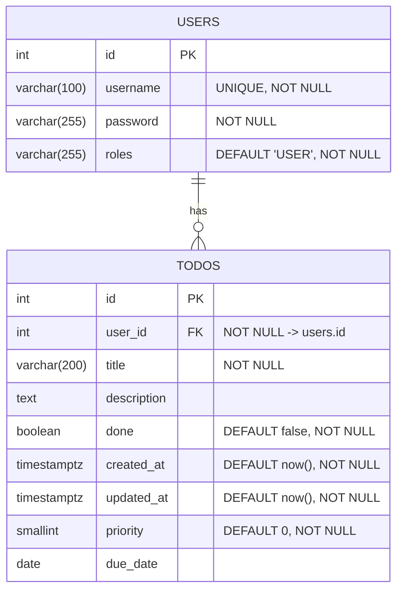

# Todo Java + React

これは、**Spring Boot（Java） + React（TypeScript）** を組み合わせたフルスタック Todo アプリです。  
JWT 認証、Docker、ElasticBeanstalk(java),ECR(Dockerイメージプッシュ）RDS(Postgres),S3,Cloudfront による本番デプロイを含む学習・実践用プロジェクトです。

---

## 🚀 特長 / ポイント

- フルスタック構成（バックエンドとフロントエンドを分離）  
- 認証は JWT（トークンベース）方式  
- コンテナ化：Dockerfile を用意  
- デプロイ先：ElasticBeanstalk（バックエンド + DB）、S3,Cloudfront（フロントエンド）  
- DBマイグレーション：Flyway  
- モダンフロント技術：React + TypeScript、TanStack Query、React Hook Form、Tailwind CSS  

---

## 🧱 技術スタック

| 層 | 技術 / フレームワーク |
|---|-------------------------|
| バックエンド | Spring Boot, MyBatis, Java |
| 認証 / セキュリティ | JWT |
| データベース | PostgreSQL |
| DB マイグレーション | Flyway |
| フロントエンド | React, TypeScript, TanStack Query, React Hook Form, Tailwind CSS |
|  ビルド / デプロイ |  Dockerfile, ElasticBeanstalk(java),ECR(Dockerイメージプッシュ）RDS(Postgres),S3,Cloudfront |

---

## 📦 構成と動作イメージ
- フロントは API を呼び出してデータを取得・表示  
- 認証は JWT トークンを `Authorization: Bearer <token>` ヘッダで送信  
- バックエンドはステートレスに設計   


## ER図


---

## 🛠️ セットアップ / ローカルでの起動方法

1. リポジトリをクローン  
   ```bash
   git clone https://github.com/miyagawa-git/todo-java-react.git
   cd todo-java-react
   ```
２．バックエンドの環境設定
todo-backend/src/main/resources/application.yml などで DB 接続情報を設定
PostgreSQL を起動
Flyway マイグレーションを自動的に適用

３．フロントエンド設定
todo-frontend/.env（もしくは .env.local） に API ベース URL をセット
例: VITE_API_BASE=http://localhost:8080

４．両方を起動
バックエンド：./gradlew bootRun（または mvn spring-boot:run）
フロントエンド：npm install → npm run dev

ブラウザで http://localhost:5173（または指定ポート）にアクセスして動作確認

📚 実装のポイント（抜粋）

JWT 認証のフィルタ設計・例外処理

SecurityConfig における CORS 設定・セッションポリシー

フロントの API 通信で Authorization ヘッダ付与

TanStack Query：データ取得・キャッシュ管理

React Hook Form：ログイン / 入力フォームのバリデーション

Route 保護（RequireAuth コンポーネント）

CI/CD：GitHub Actions によるビルド → デプロイ

Dockerfile によるイメージ作成

Render / Vercel による本番デプロイ設計

---

🌐 公開（デモ / 本番）リンクとソースコード

デモ URL：https://todo-java-react.vercel.app

🚧 注意点 / 制限事項

このプロジェクトは学習目的であり、本番向けのセキュリティ対策（例えば XSS / CSRF / トークン失効など）は完全ではありません
環境変数の安全管理が必要
無料枠利用環境ではコールドスタートや遅延が発生する可能性あり

